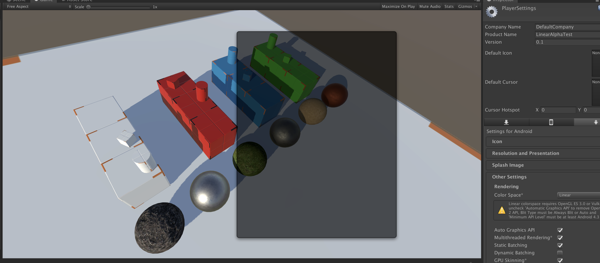

# Unity_UI_Gamma

## Blending UI elements under Linear Space.

Pics below show the UI under gamma space, linear space and linear space modified for UI.

Original solution comes from `topsekret` and `rainini`. You can find it [here](https://forum.unity.com/threads/bug-with-bypass-srgb-sampling.282469/#post-3081103)

The scene comes from Early Prototyping Material Kit.
